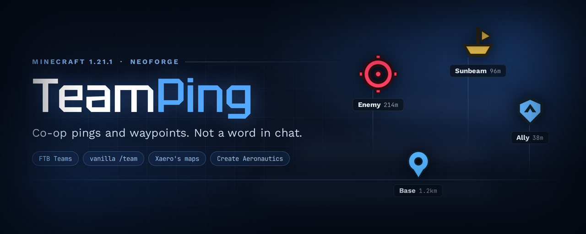
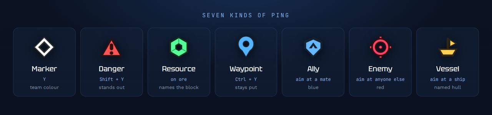

# TeamPing

Point at something, press `Y`, and everyone on your team sees a marker there.

The marker shows your name and how far away it is. If it is behind you or off to the side,
an arrow at the edge of the screen points at it. It fades on its own after twenty seconds.
Nothing is written in chat — you get the marker, a short sound, and one line above the
hotbar.

I made this for playing on airships, where shouting coordinates over voice stops working
and "look over there" means nothing when *there* is three chunks away.



## What you can mark

Aim and press the key — the mod works out what you meant.

* **Anything** — a block, the ground, the sky. Just a marker.
* **An ore block** — the marker names it, so the others see *Ancient Debris* and not just a
  dot.
* **A teammate** — a blue *Ally* marker with their name.
* **Anyone else** — a red *Enemy* marker.
* **A Create Aeronautics ship** — a *Vessel* marker on the hull, named after the ship.

`Shift + Y` marks danger instead: red, and it sounds like it.

Ally and Enemy only apply when you are actually in a team. Without one there is nobody
to tell apart, so pointing at a player just gives a marker with their name on it.

`Ctrl + Y` leaves a waypoint. Those do not fade — they stay until you take them down, they
survive a restart, and your team sees them too. Someone who joins the team later still
sees the ones placed before they arrived. `Ctrl + Shift + Y` opens the list of them.

## Keys

| Key | What it does |
|---|---|
| `Y` | mark |
| `Shift + Y` | mark danger |
| `Ctrl + Y` | leave a waypoint |
| `Alt + Y` | take down your nearest waypoint |
| `Ctrl + Shift + Y` | waypoint list |

You can rebind all of them. `Y` is a popular key, so if nothing happens, check the controls
screen first. If you dislike holding modifiers there are separate keys for danger, waypoint
and take-down — they come unbound, bind them to whatever you like.

## What it needs

NeoForge for 1.21.1. Nothing else — no Architectury, no Fabric API, no config library.

If you happen to have any of these, the mod notices and uses them:

| Mod | What changes |
|---|---|
| FTB Teams | markers only go to your party |
| vanilla `/team` | same, and it counts *alongside* FTB rather than instead of it |
| Xaero's Minimap | markers also show up on the minimap and the world map |
| Create Aeronautics | ships can be marked, and the marker sticks to the hull |

Without any of them, a marker is yours alone — the same rule waypoints follow. If you do
want everyone nearby to see them, there is a switch in the waypoint list; it is off until
you turn it on.

Both team systems count at the same time. Packs often hand out teams twice — a party *and*
a scoreboard team — and your marker should reach your mates either way. Two players are on
one team if they share either of them.

Someone without the mod can still join a server that has it, and the other way round.

## Settings

Two plain JSON files in `config/`, and you can ignore both if the defaults suit you.

`teamping-client.json` is yours alone: marker size, whether they draw through walls, the
edge arrows, sound volume, whether the distance is shown, and whether markers go to the
map.

`teamping-server.json` is the server's rules: how far you can mark (256 blocks), how often
(once a second), how many waypoints one player may keep (8), how far "nearby" reaches for
people who turned that switch on (512 blocks), and which team system to trust.

## For other mod authors

There is a small API in `dev.teamping.api` if you want to draw markers yourself, on your
own map or HUD. You do not need to filter by team — markers from other teams never reach
the client at all.

```java
TeamPingClientApi.registerListener(new PingListener() {
    @Override public void onPingAdded(Ping ping) { myMap.addMarker(ping); }
    @Override public void onPingRemoved(UUID id) { myMap.removeMarker(id); }
    @Override public void onPingsCleared()       { myMap.clearMarkers(); }
});
```

The map support inside the mod uses that same API — there is no private back door.
More detail in [neoforge/README.md](neoforge/README.md).

## Building it yourself

```
cd neoforge
gradlew build
```

The jar lands in `neoforge/build/libs/`.

## Licence

[MIT](LICENSE). Do whatever you like with it — use it, change it, put it in a pack, take
pieces for your own mod. The only thing asked in return is that my name stays in the
licence file.

Author: **Argorice**.

Thanks to the people whose mods I read while working out how to talk to Xaero's maps —
[XaeroPlus](https://github.com/rfresh2/XaeroPlus),
[MapLink](https://github.com/thebuildcraft/RemotePlayerWaypointsForXaero) and
[ping-to-map-xaeros](https://github.com/KURONAMI333/ping-to-map-xaeros) — and to
[sable-companion](https://github.com/ryanhcode/sable-companion) for a compatibility API
that made ship markers a short job instead of a long one. No code was copied from any of
them.
